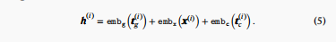

# scGPT

skip by the edge parts, mainly focus on the method

## Methods

A sc-seq data is like cell-by-gene matrix with a shape of N×G:
    1. for RNA, it's like N cells and G genes
    2. for ATCA,  it's like N cells and G chromatin accessibilities of a peak region(0/1)

the data is the raw count matrix **X**

The Input of scGPT:(consist of three parts):

1. gene/peak tokens, a gene/peak name is a basic token, so the  vocabulary consist of gene-names and some special token like: <cls>/<pad>. So one cell's gene input can be like:

2. expression values of gene, there use a tech named Split bucket to make different source of data process together.

3. Condition tokens, this is used for indicate the exp condition, a index <=> a special condition

above three is **1×M** to align

Then: 

Here:
- \(\text{embg}(t(g_i))\) gene token embedding
- \(\text{embx}(x(i))\) expression value embedding
- \(\text{embc}(t(c_i))\) condition token embedding

h(i) is **M×D**

the main block is **transformer-based**, and the transformer block is connect one by one.(impl attention tech with *flashattention*)

Cell rec: \( h(c_i) \in \mathbb{R}^D \) is obtained by intergating the \( h(n_i) \) (M×D)

模态标记就是区分这个特征是一个gene/region/peak.

批次标记就是区分一些细胞是不是一个批次的（cell/feature层级都可以用）

这俩标记是和一系列transformer block的output进行一个concat, 然后input到downstream fine-tuning, etc.

这里为了基因的no-seq的性质特意设计了一个掩码attention，简单说就是可以通过手段控制一些注意关系，这里讲了一下怎么根据已知基因去逐步推断未知基因（逐渐把置信度高的加进来，有点像self-regression？）

MLP+Mean Square Loss 估计未知基因的表达值

基因提示（Gene-Prompt）和细胞提示（Cell-Prompt）生成：
1. 这两种模式在训练中依次进行。
2. 在基因提示阶段，模型输入包括 <cls> 标记嵌入、已知基因嵌入和未知基因嵌入。使用模型的输出计算损失
3. 在细胞提示阶段，先前步骤中的输出细胞嵌入用于替换 <cls> 位置的嵌入。其他计算保持不变。

fine-tuning task: **GEP**、**GEPC**、**ECS**、**CTC**

然后针对一些**downstream tasks**进行了处理，并给出了specific的ot method

## dataset
这里逐个列了一下，方便找数据

## benchmark exps
有一些比较base的exp，type annotation，pretubation

